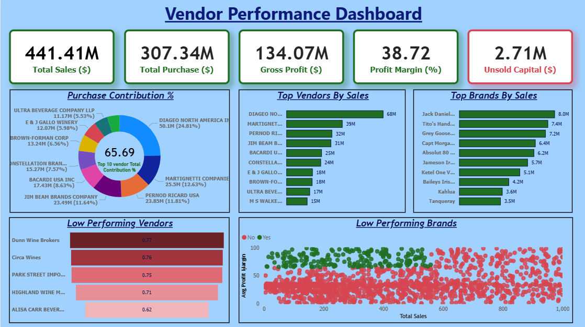

# 🧾 Vendor Performance Analysis – Retail Inventory & Sales

Analyzing vendor efficiency and profitability to support strategic purchasing and inventory decisions using SQL, Python, and Power BI.

---

## 📌 Overview

This project evaluates vendor performance and retail inventory dynamics to generate actionable insights for purchasing, pricing, and inventory optimization.

A complete data pipeline was built using:

- **SQL** for data ingestion, cleaning, and transformation
- **Python** for analysis, visualization, and statistical modeling
- **Power BI** for interactive dashboards and decision-support visuals

---

## 🎯 Business Problem

The retail sector relies heavily on efficient inventory and sales management. This project aims to answer:

- Which **brands are underperforming** and need promotional adjustments?
- Which **vendors drive the most sales and profits**?
- What is the **impact of bulk purchasing** on procurement cost?
- Where are **inventory inefficiencies**, such as slow-moving stock?
- Do vendors follow **different profit margin strategies**, and is the difference statistically significant?

---

## 📁 Dataset

Data is stored in the `/data/` directory and includes:

- `sales.csv`
- `vendors.csv`
- `inventory.csv`

A **summary table** is generated after ingestion and used for analysis.

---

## 🛠 Tools & Technologies

| Category        | Tools                                       |
| --------------- | ------------------------------------------- |
| Database & ETL  | SQL (CTEs, Joins, Filters)                  |
| Analytics       | Python (Pandas, Matplotlib, Seaborn, SciPy) |
| Visualization   | Power BI                                    |
| Version Control | Git & GitHub                                |

---

## 🧹 Data Cleaning & Preparation

Records removed:

- Gross Profit ≤ 0
- Profit Margin ≤ 0
- Sales Quantity = 0

Additional steps:

- Merged lookup and vendor tables
- Converted data types
- Handled outliers
- Created vendor-level summary tables

---

## 🔍 Exploratory Data Analysis (EDA)

### ⚠️ Negative or Zero Values

- **Gross Profit min:** –52,002.78
- **Profit Margin min:** –∞
- **Unsold Inventory:** Significant slow-moving items

### 📈 Outliers

- Freight cost values as high as **257K**
- Large variations in purchase and actual selling prices

### 🔗 Correlation Findings

| Relationship                | Correlation | Insight                          |
| --------------------------- | ----------- | -------------------------------- |
| Purchase Qty ↔ Sales Qty    | **0.999**   | Strong positive relationship     |
| Profit Margin ↔ Sales Price | –0.179      | Higher price lowers margin       |
| Purchase Price ↔ Profit     | Weak        | Price alone doesn’t drive profit |

---

## 🔬 Research Questions & Key Findings

### 1️⃣ Underperforming Brands

- **198 brands** showed _low sales but high margins_ → ideal for discount/promo campaigns.

### 2️⃣ Vendor Concentration

- Top 10 vendors account for **65.69%** of total purchases → supply chain dependency risk.

### 3️⃣ Bulk Purchase Impact

- Large orders provide **72% cost savings per unit**.

### 4️⃣ Inventory Turnover

- Approximately **$2.71M** worth of unsold inventory detected.

### 5️⃣ Vendor Profitability Groups

| Vendor Group | Mean Margin |
| ------------ | ----------- |
| High Vendors | 31.17%      |
| Low Vendors  | 41.55%      |

**Hypothesis Testing:**  
There is a statistically significant difference in profit margins → vendors follow **distinct pricing strategies**.

---

## 📊 Dashboard

The Power BI Dashboard includes:

- Vendor-wise Sales & Margins
- Bulk Purchase Savings
- Inventory Turnover Visualization
- Performance Heatmaps

**Dashboard Preview:**  


---

## 🚀 How to Run This Project

### 1️⃣ Clone the Repository

```
git clone https://github.com/yourusername/vendor-performance-analysis.git
cd vendor-performance-analysis
```

## 2️⃣ Ingest Data into the Database

```
python scripts/ingestion_db.py
```

## 3️⃣ Create Vendor Summary Table

```
python scripts/get_vendor_summary.py
```

## 4️⃣ Run Jupyter Notebooks

```
notebooks/Vendor_Performance.ipynb
```

## 5️⃣ Open Power BI Dashboard

```
dashboard/vendor_analysis.pbix
```

---

## Final Recommendations

- Diversify vendor base to reduce risk
- Optimize bulk order strategies
- Reprice slow-moving, high-margin brands
- Clear unsold inventory strategically
- Improve marketing for underperforming vendors
